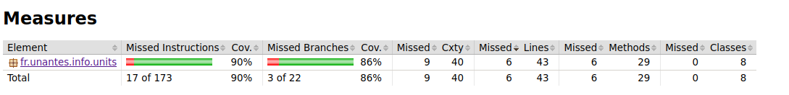
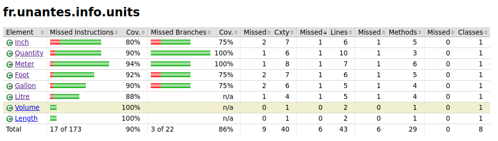
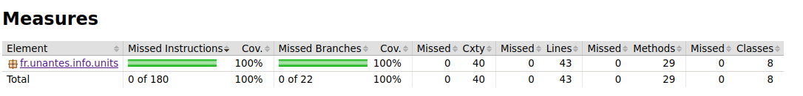
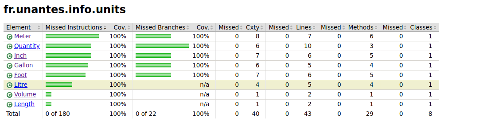
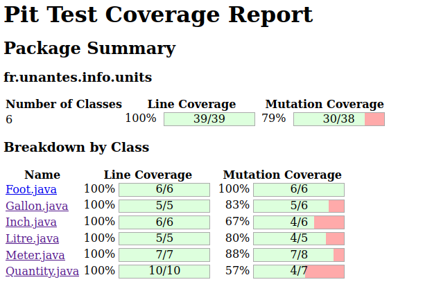
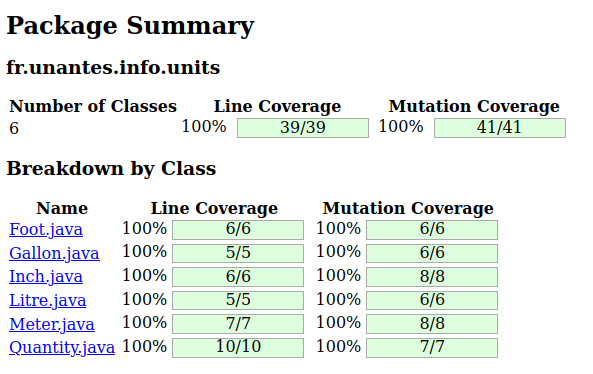

= Questions

== 1. Couverture du Code
=== a)
==== i) Les 22 tests passent bien. Cela est rassurant quand à la qualité du code, si les tests sont eux aussi de qualité.

==== ii)

==== iii) La couverture du code n'est pas suffisante, les méthodes de conversion d'une unité vers elle-même ne sont pas testées.

=== b)
==== i)

==== ii)
La méthode toGallon() de le classe Gallon a été changée pour retourner un nouvel objet de valeur val, au lieu d'un null.

La méthode toLitre() de la classe Gallon a été changée pour qu'elle retourne un Litre de valeur 4.546 fois la valeur en Gallon au lieu de 4.546.

La méthode equals() de Inch a été changée pour testée si o est une instance de Inch, au lieu de Length.

==== iii)

== 2. Analyse par mutation
=== a)

=== b)
Non, le score mutation de la suite de tests n'est pas suffisant car un nombre conséquent (8) de mutants n'ont pas été tués.

=== c)
==== ii)

La méthode add() de Meter a été changée pour retourner un Meter avec comme valeur this.val + other, au lieu de this.val + this.val

La méthode equals() de Litre a été changée pour tester en plus o instanceof Volume

La méthode equals() de Litre a été changée pour tester entre autres o instanceof Litre au lieu de o instanceof Volume

La méthode toMeter() de Inch a été changée pour retourner un Meter avec comme valeur (this.val * 0.0254) au lieu de 0.3048

La méthode toFoot() de Inch a été changée pour retourner un Meter avec comme valeur (this.val / 12) au lieu de 1

==== iii)

== 3. Conclusion
La suite de test obtenue est meilleure, cependant elle n'est pas suffisante. En effet, un niveau même parfait de couverture de code et d'élmination de mutants ne garantissent pas un logiciel sans défauts. De plus, certains aspects du code comme par exemple les valeurs de conversion ne sont pas testables au sens usuel du test logiciel; il faut aller les vérifier sur internet, chose qui a été effectué dans certains cas mais pas dans tous.